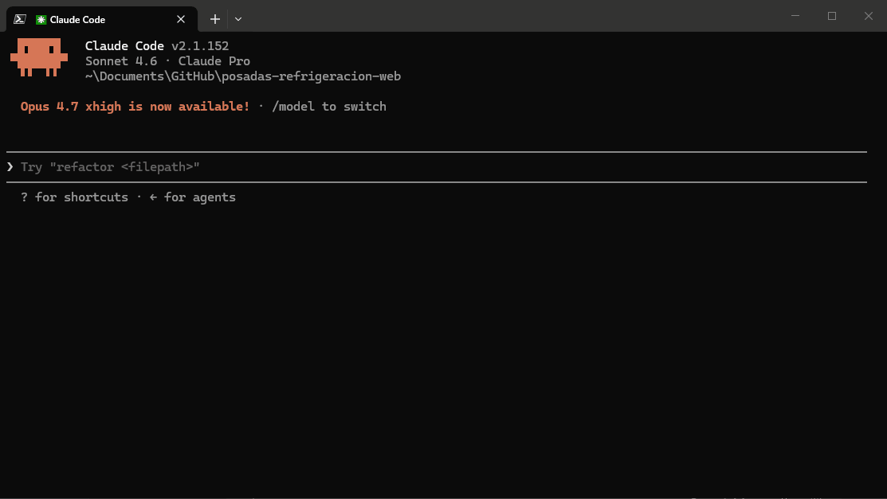

# bitácora



A documentation agent that maintains a **living knowledge base** across dev sessions — works with Claude, Gemini, Codex, Cursor, Copilot, and Windsurf.

Automatically tracks: session logbook, feature plans, task checklists, and idea backlog — all in plain markdown under `docs/dev/`.

---

## Install

### Claude Code (via skills CLI)
```bash
npx skills add JuancaSterba/bitacora
```

### Claude Code (manual)
Copy `CLAUDE.md` to your project root.

### Gemini CLI
Copy `GEMINI.md` to your project root.

### OpenAI Codex / Agents
Copy `AGENTS.md` to your project root.

### Cursor
Copy `.cursor/rules/bitacora.mdc` to your project's `.cursor/rules/` directory.

### GitHub Copilot
Copy `.github/copilot-instructions.md` to your project's `.github/` directory.

### Windsurf
Copy `.windsurfrules` to your project root.

---

## How installation works

- `npx skills add JuancaSterba/bitacora` installs into `.agents/skills/bitacora/` — this is the skills registry entry, managed automatically.
- The files in the project root (`CLAUDE.md`, `GEMINI.md`, `AGENTS.md`, `.windsurfrules`, `.cursor/rules/`) are for manual installation — copy only the one that matches your agent.
- Both methods work. If you used `npx skills add`, you do not need to copy anything manually.
- If you see both in your project, that is normal — the agent reads from the root files, the skills CLI reads from `.agents/`.

---

## What it does

Every time you work with your AI agent, bitácora:

- **Logs** what was done, what was changed, and what's next → `docs/dev/LOGBOOK.md`
- **Tracks ideas** and backlog items that come up → `docs/dev/IDEAS_BACKLOG.md`
- **Plans features** with acceptance criteria and test plans → `docs/dev/FEATURE_PLAN_*.md`
- **Breaks features into tasks** with binary done/not-done state → `docs/dev/TASKS_*.md`

At the start of any session, just say **"donde quedamos"** and the agent reconstructs exactly where you left off.

---

## Session resume

```
donde quedamos
where did we leave off
continuemos
qué sigue
catch me up
```

The agent reads the last logbook entries, active feature plan, and pending tasks, then outputs a structured brief and asks if you want to continue.

---

## Feature workflow

```
empezar feature [nombre]
trabajar en [F-ID]
nueva feature: [descripción]
```

Creates a feature plan file and task checklist. Outputs the `git checkout -b` command to run before writing code.

---

## Output format

Every response starts with a status bar:

```
📋 LOG ✅ | 🗂 BACKLOG [+1] | 🌿 feature/auth | ✅ TASKS [3 left]
```

---

## File structure created in your project

```
docs/dev/
  LOGBOOK.md
  IDEAS_BACKLOG.md
  FEATURE_PLAN_[name].md
  TASKS_[name].md
```

---

## Agent compatibility

| Agent | File |
|---|---|
| Claude Code (skills) | `SKILL.md` via `npx skills add` |
| Claude Code (manual) | `CLAUDE.md` |
| Gemini CLI | `GEMINI.md` |
| OpenAI Codex / Agents | `AGENTS.md` |
| Cursor | `.cursor/rules/bitacora.mdc` |
| GitHub Copilot | `.github/copilot-instructions.md` |
| Windsurf | `.windsurfrules` |

---

## Language

Responds in the same language you write in. Switch mid-session and it follows.

---

## Development & Contributions

If you want to modify or improve the core rules of **bitácora**, do **NOT** edit the distribution files (`CLAUDE.md`, `GEMINI.md`, etc.) directly.

This repository uses a **Single Source of Truth (SSOT)** architecture:

1. Edit the central template file: [rules_template.md](file:///C:/Users/sjcex/Documents/GitHub/bitacora/docs/dev/rules_template.md).
2. Run the synchronization script to compile and update all agent-specific rules automatically:
   ```bash
   npm run sync
   ```
3. Commit both the template and the autogenerated distribution files.

